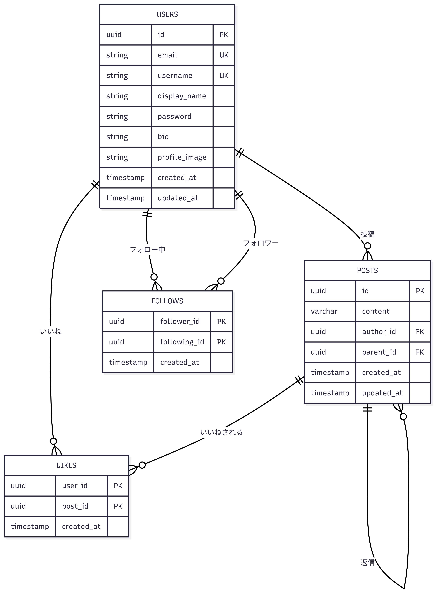

# 要件定義書

# SNSアプリケーション 要件定義書（MVP）

## プロジェクト概要

XのようなSNSアプリケーションをWeb上で開発する。
まずはMVP（実用最小限の製品）として、SNSの基本機能を実装する。

## Phase 1: 実装機能

### 1. ユーザー認証

- ユーザー登録（メールアドレス + パスワード、Clerk認証）
- ログイン・ログアウト

### 2. プロフィール機能

- プロフィール表示
- プロフィール編集（表示名、ユーザー名、自己紹介）
- プロフィール画像のアップロード

### 3. 投稿機能

- テキスト投稿（280文字制限）、画像投稿（ポストMVPで追加予定）
- 投稿の削除
- 投稿一覧の表示

### 4. タイムライン

- 全体タイムライン（全ユーザーの投稿）
- フォロー中タイムライン（フォロー中のユーザーの投稿）
- 個人タイムライン（特定ユーザーの投稿）

### 5. フォロー機能

- ユーザーのフォロー・アンフォロー
- フォロー数・フォロワー数の表示

### 6. 返信機能

- 投稿への返信
- スレッド表示（投稿と返信の紐付け）

### 7. いいね機能

- 投稿へのいいね・いいね解除
- いいね数の表示

---

## 技術スタック

### フロントエンド

- Next.js 14-15 (App Router)
- TypeScript
- App Router
- ページルーティングの簡素化
- SEO対策の容易さ

### UIライブラリ／スタイリング

- Tailwind CSS
- shadcn/ui

### バックエンド

- Next.js API Routes

### データベース

- Supabase
- Prisma

### 認証

- Clerk

### ファイルストレージ

- Cloudinary または Vercel Blob

### 開発環境／ツール

- npm
- ESLint
- Prettier

### テスト

- **Vitest**
- **Playwright** - E2Eテスト

### ホスティング

- Vercel

---

## データベース設計

### 1. Users（ユーザー）

| カラム名 | 型 | 説明 |
| --- | --- | --- |
| id | String (CUID) | 主キー |
| clerkId | String (unique) |  |
| email | String (unique) | メールアドレス |
| username | String (unique) | @ユーザー名 |
| display_name | String | 表示名 |
| password | String | ハッシュ化パスワード |
| bio | String? | 自己紹介文 |
| profile_image | String? | プロフィール画像URL |
| created_at | TIMESTAMP | 作成日時 |
| updated_at | TIMESTAMP | 更新日時 |

### 2. Posts（投稿）

| カラム名 | 型 | 説明 |
| --- | --- | --- |
| id | String (CUID) | 主キー |
| content | String (280) | 投稿内容 |
| user_id | String | 投稿者ID（外部キー） |
| parent_id | String? | 親投稿ID（返信時） |
| created_at | TIMESTAMP | 作成日時 |
| updated_at | TIMESTAMP | 更新日時 |

### 3. Follows（フォロー）

| カラム名 | 型 | 説明 |
| --- | --- | --- |
| follower_id | String(UUID) | フォローする人ID（外部キー） |
| following_id | String(UUID) | フォローされる人ID（外部キー） |
| created_at | TIMESTAMP | 作成日時 |

**制約**: (followerId, followingId) の組み合わせは一意（PRIMARY KEY (follower_id, following_id)）

### 4. Likes（いいね）

| カラム名 | 型 | 説明 |
| --- | --- | --- |
| user_id | String (UUID) | いいねした人ID（外部キー） |
| post_id | String(UUID) | いいねされた投稿ID（外部キー） |
| created_at | TIMESTAMP | 作成日時 |

**制約**: (userId, postId) の組み合わせは一意PRIMARY KEY (user_id, post_id)

## **ER図**

---

## ディレクトリ構造

x-clone/
├── 📁 src/                          # ソースコードのルートディレクトリ
│   ├── 📁 app/                      # Next.js App Router（ページとルーティング）
│   │   ├── 📄 layout.tsx            # ルートレイアウト
│   │   ├── 📄 page.tsx              # ホームページ（/）
│   │   ├── 📄 globals.css           # グローバルスタイル
│   │   ├── 📁 api/                  # API Routes
│   │   │   ├── 📁 webhooks/         # Webhookエンドポイント（Clerk連携）
│   │   │   └── 📁 test/             # テスト用API
│   │   ├── 📁 profile/              # プロフィール関連ページ
│   │   │   ├── 📄 page.tsx          # プロフィール一覧（/profile）
│   │   │   └── 📁 [username]/       # 動的ルート（ユーザー別プロフィール）
│   │   │       ├── 📄 page.tsx      # プロフィール詳細ページ
│   │   │       └── 📁 @modal/       # インターセプティングルート（モーダル）
│   │   │           └── 📁 (.)edit/  # プロフィール編集モーダル
│   │   ├── 📁 posts/                # 投稿関連ページ
│   │   ├── 📁 sign-in/              # ログインページ
│   │   ├── 📁 sign-up/              # サインアップページ
│   │   └── 📁 user/                 # ユーザー関連ページ
│   │
│   ├── 📁 components/               # Reactコンポーネント
│   │   ├── 📁 home/                 # ホーム画面用コンポーネント
│   │   │   ├── sidebar.tsx          # サイドバー
│   │   │   ├── right-sidebar.tsx    # 右サイドバー
│   │   │   ├── post-form.tsx        # 投稿フォーム
│   │   │   ├── post-item.tsx        # 投稿アイテム（簡易版）
│   │   │   ├── post-item-detailed.tsx # 投稿アイテム（詳細版）
│   │   │   ├── post-list.tsx        # 投稿リスト
│   │   │   ├── reply-form.tsx       # 返信フォーム
│   │   │   ├── reply-modal.tsx      # 返信モーダル
│   │   │   ├── live-events.tsx      # ライブイベント
│   │   │   ├── news-items.tsx       # ニュースアイテム
│   │   │   └── mobile-nav.tsx       # モバイルナビゲーション
│   │   │
│   │   ├── 📁 profile/              # プロフィール関連コンポーネント
│   │   │   ├── profile-header.tsx   # プロフィールヘッダー
│   │   │   ├── profile-info.tsx     # プロフィール情報
│   │   │   ├── profile-edit-form.tsx # プロフィール編集フォーム
│   │   │   ├── profile-tabs.tsx     # プロフィールタブ
│   │   │   └── profile-timeline.tsx # プロフィールタイムライン
│   │   │
│   │   └── 📁 ui/                   # shadcn/uiコンポーネント
│   │       ├── avatar.tsx           # アバター
│   │       ├── button.tsx           # ボタン
│   │       ├── card.tsx             # カード
│   │       ├── dialog.tsx            # ダイアログ（モーダル）
│   │       ├── input.tsx             # 入力フィールド
│   │       └── tabs.tsx              # タブ
│   │
│   ├── 📁 lib/                      # ライブラリ・ユーティリティ
│   │   ├── 📁 actions/               # Server Actions（データ書き込み）
│   │   │   ├── posts.ts             # 投稿関連のServer Actions
│   │   │   └── users.ts             # ユーザー関連のServer Actions
│   │   ├── prisma.ts                # Prismaクライアント
│   │   ├── supabase.ts              # Supabaseクライアント
│   │   ├── storage.ts               # Supabase Storage（画像アップロード）
│   │   ├── users.ts                 # ユーザー関連のデータアクセス層（読み取り）
│   │   ├── posts.ts                 # 投稿関連のデータアクセス層（読み取り）
│   │   ├── mappers.ts               # データ変換層（DB → UI）
│   │   ├── format-date.ts           # 日付フォーマット
│   │   └── utils.ts                 # 汎用ユーティリティ
│   │
│   ├── 📁 types/                    # TypeScript型定義
│   └── 📄 proxy.ts                  # Clerk認証ミドルウェア
│
├── 📁 prisma/                       # Prisma関連ファイル
│   ├── schema.prisma                # データベーススキーマ定義
│   ├── 📁 migrations/               # データベースマイグレーション
│   ├── seed.sql                     # シードデータ
│   └── SEED_README.md               # シードデータの説明
│
├── 📁 public/                       # 静的ファイル（画像、アイコンなど）
├── 📁 node_modules/                 # npmパッケージ
│
├── 📄 package.json                  # プロジェクトの依存関係とスクリプト
├── 📄 tsconfig.json                 # TypeScript設定
├── 📄 next.config.ts                # Next.js設定（画像最適化など）
├── 📄 tailwind.config.ts            # Tailwind CSS設定
├── 📄 postcss.config.mjs            # PostCSS設定
├── 📄 components.json               # shadcn/ui設定
├── 📄 eslint.config.mjs             # ESLint設定
├── 📄 prisma.config.ts              # Prisma設定
└── 📄 [README.md](http://readme.md/)                     # プロジェクト説明書

---

---

## 開発方針

- **MVP優先**: 完璧を目指さず、動くものを早く作る
- **段階的な拡張**: Phase 1完成後、必要に応じて機能を追加
- **DB設計の柔軟性**: 後からの変更を許容する（Prismaマイグレーション活用）
- **シンプル設計**: 複雑な機能は後回し、基本機能に集中

---

## 次のステップ

1. プロジェクトセットアップ
2. データベース接続設定
3. 認証機能の実装
4. 投稿・タイムライン機能の実装
5. フォロー・いいね機能の実装
6. 返信機能の実装

---

**作成日**: 2025年12月23日

**バージョン**: 1.0（MVP）